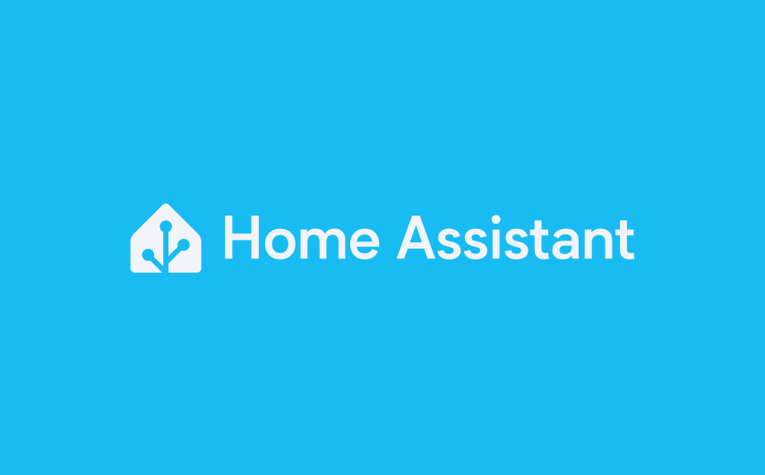
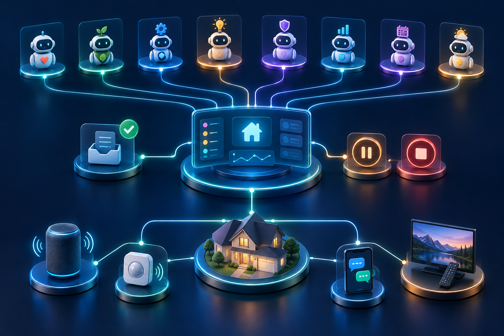
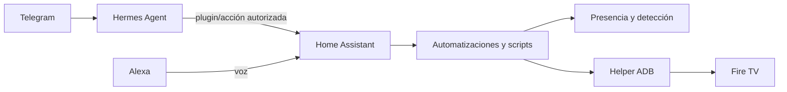

# Home Assistant personalizado

Imagen oficial de Home Assistant. La marca y el diseño pertenecen a Home Assistant y Open Home Foundation; este repositorio es una personalización independiente.

Configuración activa publicada desde el despliegue de Home Assistant en Docker del VPS. Incluye YAML activo, automatizaciones, scripts de Alexa y el helper ADB para Fire TV, con las credenciales, dispositivos y direcciones privadas sustituidos.

## Mapa visual de la integración

La ilustración resume visualmente el ecosistema. El diagrama Mermaid y las secciones siguientes describen los flujos implementados con etiquetas precisas.

## Integraciones documentadas

- Alexa enlazada con entidades y scripts de Home Assistant.
- Automatizaciones de presencia/detección basadas en sensores configurados localmente.
- Fire TV controlado mediante ADB por helper local: el emparejamiento y la clave privada se configuran en cada instalación.
- Hermes Agent se integra mediante sus plugins de Alexa/HA y puede solicitar acciones usando Home Assistant como capa de automatización.

Integración con [Hermes Agent Personalized](https://github.com/Reynaldo8509/hermes-agent-personalized) y [Hermy HQ Personalized](https://github.com/Reynaldo8509/hermy-hq-personalized).

Lee `INSTALL.md` para el despliegue y `SECURITY.md` para el límite de datos publicados. Reemplaza los valores ilustrativos y configura `secrets.yaml` localmente antes de arrancar.
